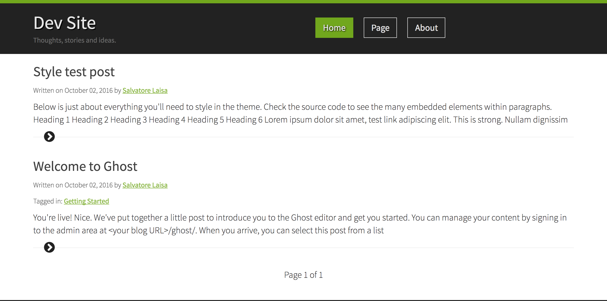

# MoebiusManiaType
### Ghost blog/website image-free theme

Simple and clean layout with typographic/icon-fonts elements only, so... faster loading times ;-)



### This theme (only) use
* **[Bootstrap](http://getbootstrap.com/)** as the main CSS framework for responsive layout and grid
* **[Fontawesome](http://fontawesome.io/)** for the icon-fonts sets
* **[Fetch & Promises](https://github.com/github/fetch) polyfills** for cross-bower use of the fetch API

### Install
* Git clone this repo or download the zip from [here](https://github.com/moebiusmania/mmtype-ghost/archive/master.zip)
* move the **mmtype-ghost** folder inside the **content/themes** folder inside your Ghost installation
* if Ghost is already running restart it  
* go to themes option in the main settings to enable this theme.

### How to use
Once the theme is active on your Ghost installation you can edit extra settings in the **options.js** inside the assets folder.

```json
{
  "disqus": "{YOUR-DISQUS-ID}",
  "social": [
    {
      "name": "{SOCIAL-NETWORK-NAME}",
      "icon": "{FONTAWESOME-ICON}",
      "url": "{YOUR-SOCIAL-NETWORK-URL}"
    }
  ]
}
```

The *disqus* field is where you put your [Disqus]() ID to enable the comment form on your site.

The *social* field is an array of possibile social networks account you want to link on the footer of your site. You can freely edit this array to match only the network you care.

The icons are provided by the [Fontawesome brand](http://fontawesome.io/icons/#brand) icon set.

You can open **options.example.js** in the assets folder to take a look at how to edit the options file.

### How to develop

> I strongly suggest to use [Yarn](https://yarnpkg.com/) as package manager and task runner, it's faster and cleaner, however you can normally use NPM with the same commands.

You **must** have the [SASS cli](http://sass-lang.com/install) installed on your machine to develop on this theme.

There are two main tasks for development, but first you have to open the terminal on theme folder and type the command

    yarn

to install all the dependencies, then you can use the default task

    yarn start

To watch all the .scss files in the assets/scss and compile them on save to plain css and concat + minify in the styles.min.css file.
Running

    yarn run build

recompiles all the files like the default task and copy the fonts folder from the Fontawesome package inside the assets folder, this is good if you need to re-deploy the theme to a server after development changes.

### Credits
Theme designed and developed by [Salvatore Laisa](http://www.salvatorelaisa.me/) (aka [Moebiusmania](https://github.com/moebiusmania/)).

### Copyright & License
Copyright (c) 2016 Salvatore Laisa (aka MoebiusMania) - Released under the MIT License.

Permission is hereby granted, free of charge, to any person obtaining a copy of this software and associated documentation files (the "Software"), to deal in the Software without restriction, including without limitation the rights to use, copy, modify, merge, publish, distribute, sublicense, and/or sell copies of the Software, and to permit persons to whom the Software is furnished to do so, subject to the following conditions:

The above copyright notice and this permission notice shall be included in all copies or substantial portions of the Software.

THE SOFTWARE IS PROVIDED "AS IS", WITHOUT WARRANTY OF ANY KIND, EXPRESS OR IMPLIED, INCLUDING BUT NOT LIMITED TO THE WARRANTIES OF MERCHANTABILITY, FITNESS FOR A PARTICULAR PURPOSE AND NONINFRINGEMENT. IN NO EVENT SHALL THE AUTHORS OR COPYRIGHT HOLDERS BE LIABLE FOR ANY CLAIM, DAMAGES OR OTHER LIABILITY, WHETHER IN AN ACTION OF CONTRACT, TORT OR OTHERWISE, ARISING FROM, OUT OF OR IN CONNECTION WITH THE SOFTWARE OR THE USE OR OTHER DEALINGS IN THE SOFTWARE.
